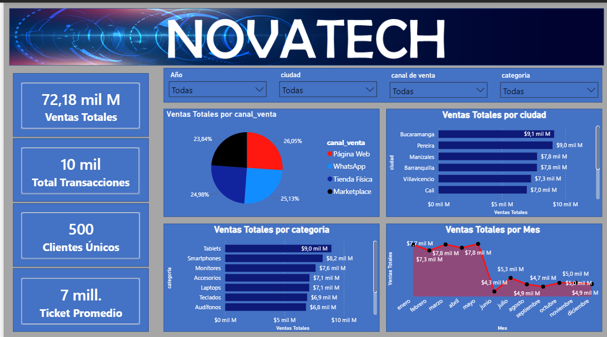
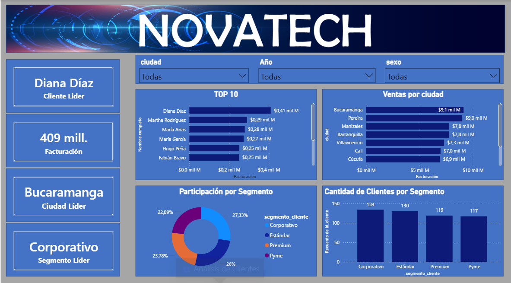
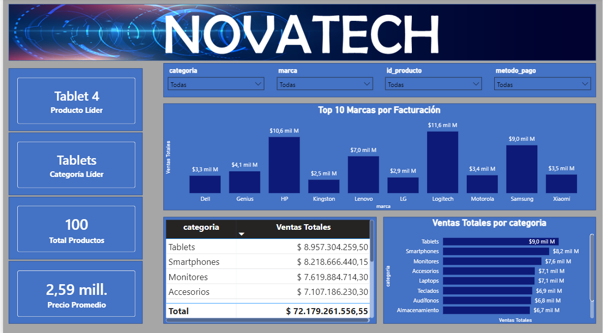
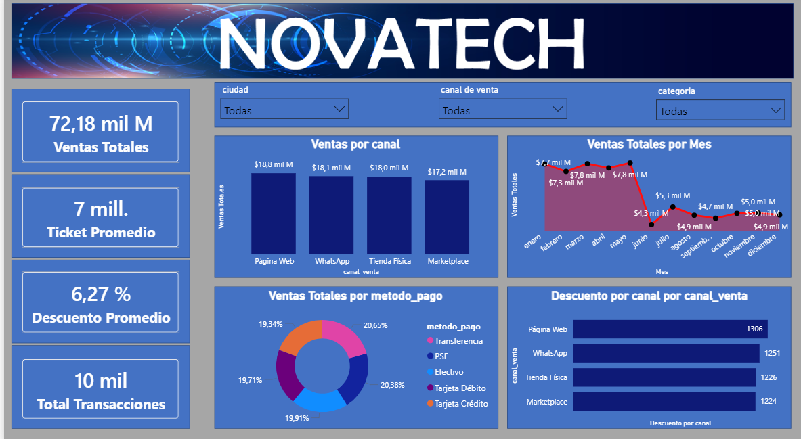
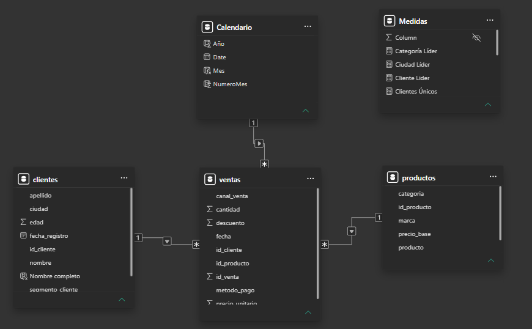

# NovaTech Colombia - Dashboard Comercial

## Descripción del Proyecto

Proyecto de análisis comercial desarrollado con Python, SQL Server y Power BI para simular la operación de una empresa de tecnología y generar información estratégica para la toma de decisiones.

El proyecto incluye generación de datos, almacenamiento en base de datos, consultas SQL, modelado de datos y construcción de dashboards interactivos.

---

## Objetivos

- Analizar el comportamiento de las ventas.
- Identificar los clientes más rentables.
- Evaluar el desempeño de productos y categorías.
- Analizar canales de venta y descuentos.
- Construir indicadores clave para la toma de decisiones.

---

## Tecnologías Utilizadas

- Python
- Pandas
- SQL Server
- Power BI
- DAX
- Git
- GitHub

---

## Estructura del Proyecto

```text
NovaTech-Colombia
│
├── Dataset
├── Documentacion
├── PowerBI
├── Python
├── SQL
└── Screenshots
```

---

## Dataset

Datos generados mediante Python:

- 500 Clientes
- 100 Productos
- 10.000 Transacciones de Venta

Archivos:

- clientes.csv
- productos.csv
- ventas.csv

---

## KPIs Analizados

### Ventas

- Ventas Totales
- Ticket Promedio
- Ventas por Canal
- Participación por Canal

### Clientes

- Clientes Únicos
- Cliente Líder
- Top 10 Clientes
- Ventas por Segmento

### Productos

- Producto Líder
- Categoría Líder
- Top Productos
- Ventas por Categoría

### Financiero

- Descuento Promedio
- Ventas por Mes
- Rentabilidad Comercial

---

## 📸 Dashboard

### Página 1 - Resumen Ejecutivo



---

### Página 2 - Análisis de Clientes



---

### Página 3 - Análisis de Productos



---

### Página 4 - Análisis Financiero



---

### Modelo de Datos



---

## Autor

Fernando Arturo Rojas Quiceno

Analista de Datos | SQL | Python | Power BI